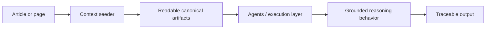

import ActivationPrompts from '../../../../components/ActivationPrompts.astro';
import RegisterContent from '../../../../components/RegisterContent.astro';

<RegisterContent register="orientation/en-us/about/architecture">

The Practice of Clarity is a guidance architecture with distinct layers for orientation, grounding, application, and evolution.

Use this page when you want the whole system shape before reading the rest.

This system only operates when its artifacts are loaded.

In practice, this means: paste the context seeder.

Without that, this is just description.

### Layer roles

- Public site: reading surface and trust-building entry
- Bridge article: human-facing path from understanding into use
- Register: accountable presentation layer only
- Context seeder: portable runtime entry that loads canonical artifacts
- Agents / execution layer: LLMs, IDE agents, and automation tools whose behavior is reshaped at runtime
- Mandate lens: contextual application logic for one real workflow
- Seeds: structural canon and stable boundary layer
- Continuity: temporal architecture, rollout memory, and drift protection

### Activation path

The architecture works in a specific order:

1. A reader encounters the public surface.
2. A bridge article shows what changes in practice.
3. In practice, this means: paste the context seeder.
4. The system activates when the context seeder is loaded into an LLM, IDE agent, or comparable execution surface.
5. The seeder loads readable canonical artifacts.
6. Those artifacts reshape behavior in the execution layer.
7. Outputs remain inspectable through trace and revision.

Article loading can shape register and entry expectations.

It does not establish operational state by itself.

Operation begins at the seeder, not at the article.

Without loaded artifacts, nothing here is in effect.

### Evolution model

Not every layer evolves at the same speed, and not every layer has the same authority.

- Seeds change slowly and should be protected from casual mutation because they define terms, posture, and boundaries.
- Lenses evolve faster, can be forked, and adapt through real workflow use.
- Continuity records why architectural and rollout decisions changed over time.
- Seeders evolve when activation needs change, but remain derivative of canonical sources.
- Bridge articles evolve when public entry needs clearer on-ramps.
- Registers evolve as accountable editions for different readers.
- The repository mediates change through visible artifacts, commits, and pull requests.

### Why this matters

Without a visible architecture, the system can feel more abstract than it really is.

This page exists so the layers can be placed quickly:

- what is canonical
- what is derivative
- what loads what
- what can evolve quickly
- what must stay stable

### Paste-ready activation

<ActivationPrompts intro="If you want to move from the system map into live use, start with the seeder. These prompts keep the boundary honest while giving you a direct runtime entry." />

### From reading to use

If you want to see the public node that exposes the trace, continue to [Act IV](/en-us/writing/articles/practice-of-clarity/act-4-a-public-node-you-can-inspect/).

If you want the first bridge into direct use, continue to [Sensible Defaults](/en-us/writing/articles/practice-of-clarity/sensible-defaults-a-lens-you-can-load/).

</RegisterContent>
