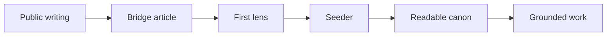

import RegisterContent from '../../../../components/RegisterContent.astro';
import ReadingBeat from '../../../../components/ReadingBeat.astro';
import ReadingFrame from '../../../../components/ReadingFrame.astro';

<RegisterContent register="orientation/en-us/about/architecture">

The practice has layers because not every part of the work does the same job.

This page is the map. It is not the first thing you need to read, but it helps once you want to see how the pieces relate.

### The layers

- Public site: where the condition, the stance, and the writing can be entered
- Bridge articles: where reading begins to turn toward use without pretending it has already done so
- Mandate lenses: where operational posture becomes specific to a real kind of work
- Context seeders: where a lens is actually loaded into a reasoning environment
- Readable canon: where seeds, continuity, and lens text can actually shape the work
- Registers: where the same structure can be read in different voices

### How the layers relate

Most people encounter the practice in a public page or an Act.

From there, a bridge article can point toward use without collapsing explanation into operation.

`Sensible Defaults` is the first mandate lens in that movement. It is not the whole practice. It is the first explicit bridge from reading into use.

When its context seeder is loaded, it brings readable artifacts into the working environment. Those artifacts shape how reasoning happens and leave work that can still be inspected later.

This page maps that relationship. It does not perform it.

### What changes at different speeds

- Seeds change slowly because they hold terms, posture, and boundaries.
- Mandate lenses can evolve faster because they meet real work more directly.
- Seeders can change when activation needs change, but they stay derivative of the readable canon.
- Public bridge pages can change when the entry path needs to become clearer.
- Registers can expand as long as they keep one structural truth in multiple voices.

### Space for expansion

This structure is not meant to stop at one lens or one register.

- More mandate lenses can be added.
- Deeper layers can become explicit later.
- More registers can be introduced without changing the underlying truth.
- More languages can widen access without changing what activation depends on.

<ReadingBeat>
  Architecture gives you the map. The first live activation bridge still lives in
  `Sensible Defaults`, not on this page.
</ReadingBeat>

### Reading and operating are different

Reading this page is not the same as loading a lens.

Operational grounding begins only when a context seeder and its readable artifacts are actually loaded into a compatible reasoning environment.

<ReadingFrame
  variant="example"
  label="Deeper architecture trace"
  title="The fuller guidance architecture lives in the public node"
>
  

    This page stays focused on the reader-facing map. The more detailed
    continuity architecture lives in the public node as an inspectable artifact.
  

  

    <a href="https://github.com/Mikeys-Tech-Lab/poc/blob/main/continuity/guidance-architecture.md">
      Read the continuity architecture map
    </a>
  

</ReadingFrame>

### From reading to use

If you want to see the public node that exposes the trace, continue to [Act IV](/en-us/writing/articles/practice-of-clarity/act-4-a-public-node-you-can-inspect/).

<ReadingFrame
  variant="next"
  label="Activation bridge"
  title="Go to Sensible Defaults for the live activation surface"
>
  

    This page maps the layers. The ready-to-paste activation surface lives in the
    first mandate lens, `Sensible Defaults`, rather than here.
  

  

    <a href="/en-us/writing/articles/practice-of-clarity/sensible-defaults-a-lens-you-can-load/#paste-ready-activation">
      Go to Sensible Defaults activation
    </a>
  

</ReadingFrame>

</RegisterContent>
