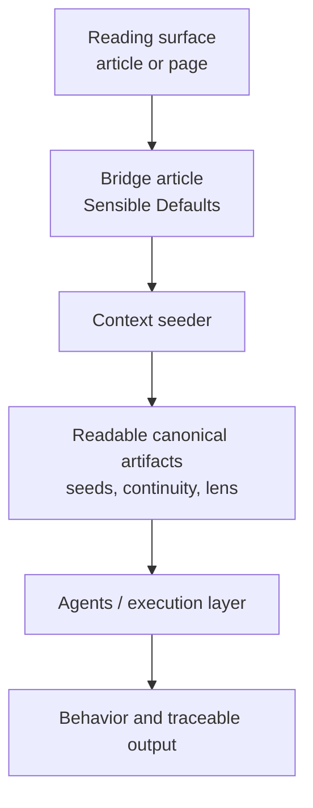

import ReadingBeat from '../../../../../components/ReadingBeat.astro';
import ReadingFrame from '../../../../../components/ReadingFrame.astro';

The Practice of Clarity is not only a body of writing.

This page is the quickest way to see the whole system at once.

This system only operates when its artifacts are loaded.

In practice, this means: paste the context seeder.

Without that, this is just description.

It is a guidance system with layers that do different jobs.

### The layers

- Public site: the reading and orientation surface
- Bridge article: the first easy entry into use
- Register: the same structure in different voices
- Context seeder: the portable activation surface
- Agents / execution layer: where loaded artifacts reshape behavior
- Mandate lens: the first applied reasoning layer
- Seeds: the structural canon
- Continuity: the memory and architecture layer

### How it works in practice

1. A reader enters through the public site.
2. `Sensible Defaults` is the first bridge from reading into use.
3. That bridge points to the live activation surface.
4. The system activates when the context seeder is loaded into an LLM, IDE agent, or comparable execution surface.
5. The seeder loads the readable canonical artifacts.
6. Those artifacts reshape behavior in the execution layer.
7. The resulting work stays traceable and can be revised over time.

### What changes at different speeds

- Seeds change slowly.
- Continuity changes when architecture or rollout understanding changes.
- Lenses and bridge articles change faster through use and feedback.
- Register changes readability, not structural meaning.
- The repository is where changes are proposed and reviewed.

### Important boundary

Reading about the system is not the same as activating it.

Operational grounding begins only when readable canonical artifacts are loaded.

<ReadingBeat>
  This page explains the structure. The live activation surface lives in
  `Sensible Defaults`.
</ReadingBeat>

### From reading to use

If you want to see the public node that exposes the trace, continue to [Act IV](/en-us/writing/articles/practice-of-clarity/act-4-a-public-node-you-can-inspect/).

<ReadingFrame
  variant="next"
  label="Activation bridge"
  title="Go to Sensible Defaults for the live activation surface"
>
  

    This page shows the layers. The ready-to-paste activation surface lives in
    `Sensible Defaults`, not here.
  

  

    <a href="/en-us/writing/articles/practice-of-clarity/sensible-defaults-a-lens-you-can-load/#paste-ready-activation">
      Go to Sensible Defaults activation
    </a>
  

</ReadingFrame>
