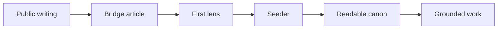

import ReadingBeat from '../../../../../components/ReadingBeat.astro';
import ReadingFrame from '../../../../../components/ReadingFrame.astro';

The practice has layers because not every part of the work does the same job.

This page is the map. You do not need it first, but it helps when you want to see how the pieces fit together.

### The layers

- Public site: where the condition, the stance, and the writing can be entered
- Bridge articles: where reading begins to turn toward use
- Mandate lenses: where operational posture becomes specific
- Context seeders: where a lens is actually loaded
- Readable canon: where seeds, continuity, and lens text can shape the work
- Registers: where the same structure can be read in different voices

### How the layers relate

Most people meet the practice in a public page or an Act.

From there, a bridge article can lead toward use without pretending that reading is already operation.

`Sensible Defaults` is the first mandate lens in that movement. It is the first bridge into use, not the whole practice.

When its context seeder is loaded, it brings readable artifacts into the working environment. Those artifacts shape how reasoning happens and help keep the work traceable.

### What changes at different speeds

- Seeds change slowly.
- Mandate lenses and bridge articles change faster through use and feedback.
- Registers can change readability without changing structural meaning.

### Space for expansion

- More mandate lenses can be added.
- Deeper layers can become explicit later.
- More registers can be introduced without changing the underlying truth.
- More languages can widen access without changing what activation depends on.

### Reading and operating are different

Reading this page is not the same as loading a lens.

Operational grounding begins only when a context seeder and its readable artifacts are actually loaded into a compatible reasoning environment.

<ReadingFrame
  variant="example"
  label="Deeper architecture trace"
  title="The fuller guidance architecture lives in the public node"
>
  

    This page stays focused on the reader-facing map. The more detailed
    continuity architecture lives in the public node as an inspectable artifact.
  

  

    <a href="https://github.com/Mikeys-Tech-Lab/poc/blob/main/continuity/guidance-architecture.md">
      Read the continuity architecture map
    </a>
  

</ReadingFrame>

<ReadingBeat>
  This page gives you the map. The first live activation bridge still lives in
  `Sensible Defaults`, not here.
</ReadingBeat>

### From reading to use

If you want to see the public node that exposes the trace, continue to [Act IV](/en-us/writing/articles/practice-of-clarity/act-4-a-public-node-you-can-inspect/).

<ReadingFrame
  variant="next"
  label="Activation bridge"
  title="Go to Sensible Defaults for the live activation surface"
>
  

    This page shows the layers. The ready-to-paste activation surface lives in
    the first mandate lens, `Sensible Defaults`, not here.
  

  

    <a href="/en-us/writing/articles/practice-of-clarity/sensible-defaults-a-lens-you-can-load/#paste-ready-activation">
      Go to Sensible Defaults activation
    </a>
  

</ReadingFrame>
