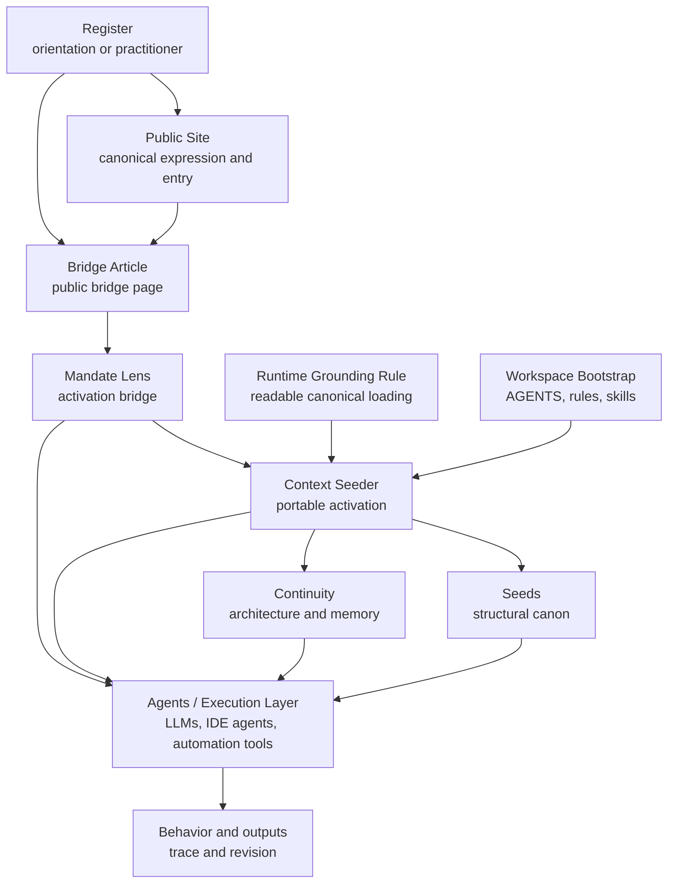
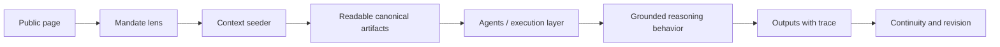

# Guidance Architecture
## Continuity View Of The System Stack

**Author:** Mikey Sebastian Drozd  
**Pronouns:** he/him · they/them  
**Website:** https://practiceofclarity.eu  
**Source:** https://github.com/Mikeys-Tech-Lab/poc/blob/main/continuity/guidance-architecture.md  
**Copyright:** © 2026 Mikey Sebastian Drozd  
**License:** [CC BY 4.0](https://github.com/Mikeys-Tech-Lab/poc/blob/main/LICENSE-CC-BY-4.0). Repository code and tooling: [MIT](https://github.com/Mikeys-Tech-Lab/poc/blob/main/LICENSE).

---

## Purpose

This document makes the current guidance system visible as a layered
architecture.

It exists to preserve the current system shape, not only the prose that
describes it.

This is a continuity artifact, not a seed.

It can evolve as the architecture evolves.

---

## Core framing

The Practice of Clarity is not only a body of writing.

It is a guidance architecture with distinct layers for orientation, grounding,
application, execution, and evolution.

In practice, it can be understood as a runtime constraint layer for reasoning.

This system only operates when its artifacts are loaded.

In practice, this means loading the context seeder into an LLM, IDE agent, or
comparable execution surface.

Without that, the architecture remains description only.

Not every layer evolves at the same speed, and not every layer has the same
authority.

That difference is part of what keeps the system legible.

---

## Current stack

---

## Layer roles

- Public site: canonical human-facing expression, reading surface, and first
  entry
- Bridge article: public bridge page that can move a reader toward the
  activation bridge
- Register: accountable presentation layer that changes readability without
  changing structural meaning
- Mandate lens: activation bridge that brings the practice toward one workflow
- Context seeder: portable activation surface that loads canonical artifacts
- Agents / execution layer: the runtime surfaces where loaded artifacts reshape
  behavior
- Seeds: structural canon, terms, posture, and misuse boundaries
- Continuity: temporal anchors, architecture memory, and rollout discipline
- Runtime grounding rule: the boundary between description and operation
- Workspace bootstrap: repo-native entrypoint for development and agent work,
  rooted in `seeds/` and `continuity/`

---

## Activation path

Public pages can shape register and entry expectations.

Operational grounding begins only when the seeder loads readable canonical
artifacts.

If readable canonical artifacts are missing, the system is not active.

The system activates when a context seeder is loaded into an LLM, IDE agent, or
comparable execution surface.

Without that, nothing here is in effect.

---

## Workspace bootstrap

For repo-native development and agent work, the default bootstrap posture is:

- `AGENTS.md`
- `seeds/`
- `continuity/`

This baseline is always-on workspace grounding.

It is not the same as loading a mandate lens.

Load `mandateLenses/SensibleDefaults/context-seeder.md` only on demand when a
prompt explicitly asks for that lens or when a development or workspace change
needs delivery-reality framing.

---

## Evolution model

Different layers evolve for different reasons:

- Seeds evolve slowly and should be protected from casual mutation because they
  define terms, posture, and boundary logic.
- Lenses evolve faster, can be forked, and adapt through real use in specific
  workflows.
- Continuity evolves when architecture understanding, rollout logic, or
  temporal orientation changes, and records why those decisions were made.
- Seeders evolve when activation needs change, but remain derivative of
  canonical sources.
- Bridge articles evolve when the public explanation and path toward activation
  need to become clearer.
- Registers evolve as accountable editions for different readers.
- The repository mediates change through visible artifacts, commits, and pull
  requests.
- Workspace bootstrap evolves as repo-native development practice changes.

The system only stays legible if these change speeds remain visible.

If everything evolves at once, authority collapses into noise.

---

## Boundary between public and internal surfaces

The public architecture surface can explain the guidance stack in reader-facing
terms.

It should not carry the full internal workspace machinery.

Internal repo architecture may map:

- file structure
- bootstrap surfaces
- rules and skills
- contributor-facing execution paths

If the public layer starts leaking internal orchestration, the boundary has
drifted.

---

## Why this matters

Without a visible architecture map, the system can feel more abstract than it
really is.

The architecture becomes easier to place once the layers are visible at once:

- what is canonical
- what is derivative
- what loads what
- what changes slowly
- what changes quickly
- where public entry happens
- where operation actually begins
