# Workspace Architecture

This is the canonical architecture document for the Practice of Clarity workspace.

## Update rules

- Any PR that changes repo structure, tooling entrypoints, or docs site layout updates this file in the same PR (or explicitly states why not).
- If the diagram and the actual file tree/config diverge, the file tree/config is the source of truth and this file must be corrected.
- This document is descriptive. It must not become a gate or a compliance artifact.

## What this diagram represents

The diagram shows the current repo architecture: where canonical guidance lives, how adapters derive from it, where tooling and reports sit, and how the frontend relates to the rest.
The public site is the canonical expression and entry surface. This document maps the repository layer that supports inspection, evolution, and operation behind it.

## What this diagram does not represent

- Runtime behavior or deployment topology
- Future aspirational state (only current reality)
- Relationships between individual files (only directories and roles)

## Current architecture

```mermaid
flowchart TD
  Seeds[seeds/] -->|"default bootstrap"| Agents[AGENTS.md]
  Continuity[continuity/] -->|"default bootstrap"| Agents
  MandateLenses[mandateLenses/] -->|"on-demand lens canon"| Agents
  Practices["docs/practices/"] -.->|"derived explainers"| MandateLenses

  Agents -->|"always-apply rules"| CursorRules[.cursor/rules/]
  Agents -->|"stack skills"| CursorSkills[.cursor/skills/]
  Agents -->|"thin pointer"| Claude[.claude/]
  Agents -->|"thin pointer"| Copilot[.github/copilot-instructions.md]

  Agents -->|"capability checks"| Tooling[tools/ai-guidance/]
  Tooling -->|"auditable reports"| DocsAI[docs/ai/]
  Tooling -->|"informs"| CursorSkills
  Tooling -->|"guidance drift validator"| Onboarding
  Tooling -->|"guidance drift validator"| EvolutionArcGuide
  Tooling -->|"guidance drift validator"| TraceClimbGuide
  Tooling -->|"license surface validator"| Guidance

  Guidance[docs/guidance/] -.->|"describes"| Agents
  Architecture[docs/architecture/] -.->|"describes"| Agents
  Decisions[docs/decisions/] -.->|"structural rationale"| Agents
  Onboarding[docs/onboarding/] -.->|"newcomer paths"| Agents
  OnboardSkill[".cursor/skills/onboarding/"] -->|"reads index"| Onboarding
  EvolutionArcSkill[".cursor/skills/evolution-arc/"] -->|"reads trace map"| EvolutionArcGuide["docs/guidance/evolution-arc.md"]
  TraceClimbSkill[".cursor/skills/trace-climb/"] -->|"reads flow guide"| TraceClimbGuide["docs/guidance/trace-climb.md"]
  TraceClimbGuide -->|"stores durable learning in"| GuidanceRecords["docs/guidance/evolution-records/"]
  SensibleDefaultsSkill[".cursor/skills/sensible-defaults/"] -->|"loads on demand"| MandateLenses
  EvolutionArcGuide -.->|"curates"| Decisions
  EvolutionArcGuide -.->|"curates"| Architecture
  EvolutionArcGuide -.->|"curates"| Guidance

  LocalConfig[".local/config.md"] -.->|"operator-local values"| OperatorBoundary["operator-mediated disclosure"]
  OperatorBoundary -.->|"minimum necessary runtime facts"| Agents
  Renovate["renovate.json"] -.->|"routine dependency updates"| Tooling
  Dependabot[".github/dependabot.yml"] -.->|"security-only updates"| Tooling

  AstroSite[apps/site/] -->|"practitioner content"| SiteDocs["apps/site/src/content/docs/"]
  AstroSite -->|"active orientation register content"| SiteRegisterOrientation["apps/site/src/content/register/orientation/"]
  AstroSite -->|"route-scoped everyday register content"| SiteRegisterEveryday["apps/site/src/content/register/everyday/"]
  AstroSite -->|"locale-scoped essay support data"| SiteStructuralEssayData["apps/site/src/content/structural-essays/"]
  AstroSite -->|"essay route mechanics"| SiteStructuralEssayLib["apps/site/src/lib/structural-essays/"]

  subgraph "CI/CD (GitHub Actions)"
    DeployDev[".github/workflows/deploy-dev.yml"]
    DeployPreview[".github/workflows/deploy-preview.yml"]
    DeployProd[".github/workflows/deploy-production.yml"]
  end

  subgraph "CI / Security Scanning"
    SecretScan["secret-scan.yml\n(gitleaks)"]
    SupplyChain["supply-chain.yml\n(Shai-Hulud)"]
    CodeQL["codeql.yml"]
    ScoreCard["scorecard.yml\n(OSSF)"]
    LiveScan["security-scan-live.yml\n(Nuclei)"]
    GuidanceReview["guidance-drift-review.yml\n(advisory AI reasoning layer)"]
  end

  subgraph "Release Automation"
    ReleasePlease[".github/workflows/release.yml\n(Release Please + auto-merge)"]
    AppToken["GitHub App token\n(actions/create-github-app-token)"]
    RPConfig["release-please-config.json"]
    RPManifest[".release-please-manifest.json"]
    GitHubRelease["GitHub Release\n(tag published)"]
  end

  DeployDev -->|"pnpm run build\n+ rsync over SSH"| InfomaniakDev["Infomaniak: seed.practiceofclarity.eu"]
  DeployPreview -->|"pnpm run build\n+ rsync over SSH"| InfomaniakPreview["Infomaniak: preview.practiceofclarity.eu"]
  DeployProd -->|"pnpm run build\n+ rsync over SSH\n(manual dispatch)"| InfomaniakProd["Infomaniak: practiceofclarity.eu"]
  DeployDev -->|"triggers"| LiveScan
  DeployPreview -->|"triggers"| LiveScan
  DeployProd -->|"triggers"| LiveScan
  InfomaniakPreview -.->|"Cloudflare Access\n(email OTP)"| CFAccess["Cloudflare Zero Trust"]
  Renovate -.->|"action version updates"| SecretScan
  Renovate -.->|"action version updates"| CodeQL
  GuidanceReview -.->|"comments on PRs"| Onboarding
  GuidanceReview -.->|"surfaces drift"| EvolutionArcGuide
  GuidanceReview -.->|"surfaces drift"| TraceClimbGuide
  AppToken -->|"installation token"| ReleasePlease
  RPConfig -.->|"package definitions"| ReleasePlease
  RPManifest -.->|"current versions"| ReleasePlease
  ReleasePlease -->|"version bumps + CHANGELOG"| RootPkg["package.json\n(PoC)"]
  ReleasePlease -->|"version bumps + CHANGELOG"| AstroSite
  ReleasePlease -->|"version bumps + CHANGELOG"| Tooling
  ReleasePlease -->|"publishes"| GitHubRelease
  GitHubRelease -->|"triggers"| DeployDev
  GitHubRelease -->|"triggers"| DeployPreview
```

## Directory roles

| Path | Role | Status |
|---|---|---|
| `seeds/` | Structural seed canon for the Practice of Clarity at repo root | Exists |
| `continuity/` | Root continuity package family: temporal anchors and architecture memory | Exists |
| `mandateLenses/` | Root runtime lens package family: canonical lenses and context seeders | Exists |
| `docs/practices/` | Derived explainers and bridge docs for canonical lens packages | Exists |
| `AGENTS.md` | Canonical agent guidance (single source of truth) | Exists |
| `.cursor/rules/` | Cursor always-apply and file-scoped rules (includes security-awareness) | Exists |
| `.cursor/skills/` | Cursor project skills (astro-starlight, node-tooling, git-commit, github-automation, dependency-management, renovate-operations, infomaniak-deployment, onboarding, evolution-arc, trace-climb, sensible-defaults) | Exists |
| `.claude/` | Claude Code adapter (thin pointer to AGENTS.md) | Exists |
| `.github/` | PR template, Copilot instructions, Dependabot security config, prompt files for advisory automation | Exists |
| `renovate.json` | Renovate routine dependency policy, grouping, automerge, and dashboard behavior | Exists |
| `.github/workflows/` | CI/CD (deploy-dev, deploy-preview, deploy-production, release), security scanning (gitleaks, Shai-Hulud, CodeQL, Scorecard, Nuclei live scan), guidance drift review | Exists |
| `release-please-config.json` | Release Please package definitions and changelog sections | Exists |
| `.release-please-manifest.json` | Tracks current version of each versioned package | Exists |
| `.local/` | Operator-specific local config (gitignored), not a normal agent input. Template: `.local.example.md` | Exists |
| `docs/onboarding/` | Newcomer and repo-history entry paths (topic index, local setup, AI guidance, workspace, evolution arc, trace-climb, security, infra, contributing) | Exists |
| `docs/guidance/` | Descriptive guidance docs (conventions, change process, evolution trace map, Trace Climb flow) | Exists |
| `docs/guidance/evolution-records/` | Durable learning artifacts produced by Trace Climb | Exists |
| `docs/architecture/` | Architecture docs + this canonical diagram | Exists |
| `docs/decisions/` | Architecture Decision Records (ADRs) — structural rationale with trace | Exists |
| `docs/ai/` | Capability alignment reports (generated) | Exists |
| `tools/ai-guidance/` | pnpm + TS + Vitest tooling for capability checks, deterministic guidance drift validation, and license surface validation | Exists |
| `apps/site/` | Astro Starlight frontend | Exists |
| `apps/site/src/content/docs/` | Practitioner site content collection | Exists |
| `apps/site/src/content/register/orientation/` | Active orientation register content collection | Exists |
| `apps/site/src/content/register/everyday/` | Route-scoped everyday register content collection. Only routes that declare everyday availability expose it. | Exists |
| `apps/site/src/content/structural-essays/` | Locale-scoped shared public essay support data, such as source ledgers, further reading, and anchor maps reused across registers and overview surfaces | Exists |
| `apps/site/src/lib/structural-essays/` | Structural essay route mechanics and other non-prose helpers kept separate from public essay support data | Exists |
| `docs/infra/` | Infrastructure runbooks (Infomaniak setup, GitHub App setup, protection layers, authenticated origin pulls) and maintenance assets | Exists |
| `.cursor/skills/infomaniak-deployment/` | Deployment skill for Infomaniak hosting | Exists |

<!--
Copyright © 2026 Mikey Sebastian Drozd.
Licensed under CC BY 4.0. Repository code and tooling: MIT.
-->
