# Workspace Architecture

This is the canonical architecture document for the Practice of Clarity workspace.

## Update rules

- Any PR that changes repo structure, tooling entrypoints, or docs site layout updates this file in the same PR (or explicitly states why not).
- If the diagram and the actual file tree/config diverge, the file tree/config is the source of truth and this file must be corrected.
- This document is descriptive. It must not become a gate or a compliance artifact.

## What this diagram represents

The diagram shows the current repo architecture: where canonical guidance lives, how adapters derive from it, where tooling and reports sit, and how the frontend relates to the rest.

## What this diagram does not represent

- Runtime behavior or deployment topology
- Future aspirational state (only current reality)
- Relationships between individual files (only directories and roles)

## Current architecture

```mermaid
flowchart TD
  Seeds[seeds/] -->|"dev-only sources"| Agents[AGENTS.md]
  Practices["docs/practices/"] -->|"operational lenses"| Agents

  Agents -->|"always-apply rules"| CursorRules[.cursor/rules/]
  Agents -->|"stack skills"| CursorSkills[.cursor/skills/]
  Agents -->|"thin pointer"| Claude[.claude/]
  Agents -->|"thin pointer"| Copilot[.github/copilot-instructions.md]

  Agents -->|"capability checks"| Tooling[tools/ai-guidance/]
  Tooling -->|"auditable reports"| DocsAI[docs/ai/]
  Tooling -->|"informs"| CursorSkills

  Guidance[docs/guidance/] -.->|"describes"| Agents
  Architecture[docs/architecture/] -.->|"describes"| Agents
  Decisions[docs/decisions/] -.->|"structural rationale"| Agents
  Onboarding[docs/onboarding/] -.->|"newcomer paths"| Agents
  OnboardSkill[".cursor/skills/onboarding/"] -->|"reads index"| Onboarding

  LocalConfig[".local/config.md"] -.->|"operator prefs"| Agents
  Dependabot[".github/dependabot.yml"] -.->|"version updates"| Tooling

  AstroSite[apps/site/] -->|"site content"| SiteDocs["apps/site/src/content/docs/"]

  subgraph "CI/CD (GitHub Actions)"
    DeployDev[".github/workflows/deploy-dev.yml"]
    DeployPreview[".github/workflows/deploy-preview.yml"]
  end

  subgraph "CI / Security Scanning"
    SecretScan["secret-scan.yml\n(gitleaks)"]
    SupplyChain["supply-chain.yml\n(Shai-Hulud)"]
    CodeQL["codeql.yml"]
    ScoreCard["scorecard.yml\n(OSSF)"]
    LiveScan["security-scan-live.yml\n(Nuclei)"]
  end

  subgraph "Release Automation"
    ReleasePlease[".github/workflows/release.yml\n(Release Please + auto-merge)"]
    AppToken["GitHub App token\n(actions/create-github-app-token)"]
    RPConfig["release-please-config.json"]
    RPManifest[".release-please-manifest.json"]
    GitHubRelease["GitHub Release\n(tag published)"]
  end

  DeployDev -->|"pnpm run build\n+ rsync over SSH"| InfomaniakDev["Infomaniak: seed.practiceofclarity.eu"]
  DeployPreview -->|"pnpm run build\n+ rsync over SSH"| InfomaniakPreview["Infomaniak: preview.practiceofclarity.eu"]
  DeployDev -->|"triggers"| LiveScan
  DeployPreview -->|"triggers"| LiveScan
  InfomaniakPreview -.->|"Cloudflare Access\n(email OTP)"| CFAccess["Cloudflare Zero Trust"]
  Dependabot -.->|"action version updates"| SecretScan
  Dependabot -.->|"action version updates"| CodeQL
  AppToken -->|"installation token"| ReleasePlease
  RPConfig -.->|"package definitions"| ReleasePlease
  RPManifest -.->|"current versions"| ReleasePlease
  ReleasePlease -->|"version bumps + CHANGELOG"| RootPkg["package.json\n(PoC)"]
  ReleasePlease -->|"version bumps + CHANGELOG"| AstroSite
  ReleasePlease -->|"version bumps + CHANGELOG"| Tooling
  ReleasePlease -->|"publishes"| GitHubRelease
  GitHubRelease -->|"triggers"| DeployDev
  GitHubRelease -->|"triggers"| DeployPreview
```

## Directory roles

| Path | Role | Status |
|---|---|---|
| `seeds/` | Development-only canonical sources for the Practice of Clarity | Exists |
| `docs/practices/` | Practice documents and operational lenses (e.g., Sensible Defaults) | Exists |
| `AGENTS.md` | Canonical agent guidance (single source of truth) | Exists |
| `.cursor/rules/` | Cursor always-apply and file-scoped rules (includes security-awareness) | Exists |
| `.cursor/skills/` | Cursor project skills (astro-starlight, node-tooling, git-commit, github-automation, dependency-management, infomaniak-deployment, onboarding) | Exists |
| `.claude/` | Claude Code adapter (thin pointer to AGENTS.md) | Exists |
| `.github/` | PR template, Copilot instructions, Dependabot config | Exists |
| `.github/workflows/` | CI/CD (deploy-dev, deploy-preview, release), security scanning (gitleaks, Shai-Hulud, CodeQL, Scorecard, Nuclei live scan) | Exists |
| `release-please-config.json` | Release Please package definitions and changelog sections | Exists |
| `.release-please-manifest.json` | Tracks current version of each versioned package | Exists |
| `.local/` | Operator-specific config (gitignored). Template: `.local.example.md` | Exists |
| `docs/onboarding/` | Newcomer onboarding paths (topic index, local setup, AI guidance, workspace, security, infra, contributing) | Exists |
| `docs/guidance/` | Descriptive guidance docs (conventions, change process) | Exists |
| `docs/architecture/` | Architecture docs + this canonical diagram | Exists |
| `docs/decisions/` | Architecture Decision Records (ADRs) — structural rationale with trace | Exists |
| `docs/ai/` | Capability alignment reports (generated) | Exists |
| `tools/ai-guidance/` | pnpm + TS + Vitest tooling for capability checks | Exists |
| `apps/site/` | Astro Starlight frontend | Exists |
| `docs/infra/` | Infrastructure runbooks (Infomaniak setup, GitHub App setup, protection layers, authenticated origin pulls) and maintenance assets | Exists |
| `.cursor/skills/infomaniak-deployment/` | Deployment skill for Infomaniak hosting | Exists |
