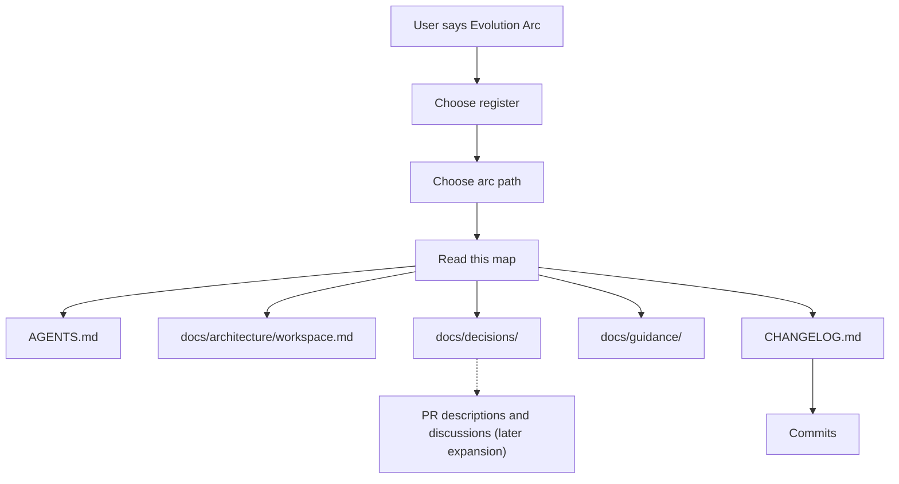
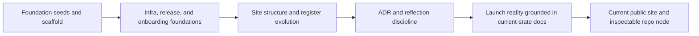

# Evolution Arc

This document is the repo-local map behind the `Evolution Arc` command.

It is not a second changelog.

It is a guide to where the trace lives, how to follow it, and what each surface can honestly tell you.

## How the arc is entered

The command asks which register the reader wants:

- **Practitioner** for working detail and architectural trace
- **Orientation** for a step-by-step path through the same structure

The register changes the voice, not the evidence.

## Current high-level arc

Read that sequence like this:

- **Foundation seeds and scaffold**: the repository started with development sources in `seeds/` and the initial workspace scaffold. This is the earliest visible shape of the current node.
- **Infra, release, and onboarding foundations**: deployment, release automation, security scanning, and the onboarding system became part of the repo's working surface. See `CHANGELOG.md` and the onboarding docs.
- **Site structure and register evolution**: the docs site, locale structure, and register model were refined through implementation work and later corrected when earlier assumptions drifted.
- **ADR and reflection discipline**: the repo started recording structural decisions in `docs/decisions/` and structural lessons in `docs/guidance/`.
- **Launch reality grounded in current-state docs**: ADR `0002` explicitly reset the repo's public description to verified present reality instead of older assumptions.
- **Current public site and inspectable repo node**: the published frontend is now the primary human reading surface, while the repository remains the inspectable operational node behind it.

## What each surface contributes

| Surface | What it shows well | What it does not show well |
|---|---|---|
| `AGENTS.md` | Canonical behavior, invariants, evolution discipline | Exact chronology |
| `docs/architecture/workspace.md` | Current structure and relationships | Why every change happened |
| `docs/decisions/` | Structural rationale and rejected alternatives | Day-to-day implementation detail |
| `docs/guidance/` | Reflections, mistakes, guardrails, and evolution patterns | Full release timeline |
| `CHANGELOG.md` | Release-level chronology and grouped milestones | Full reasoning for each change |
| Commits | Fine-grained sequence of changes | Stable narrative on their own |
| PR descriptions and discussions | Rich implementation trace and corrections | Guaranteed availability in-repo |

## How to read the trace honestly

Use the repo in layers:

1. Start with current canon: `AGENTS.md` and `docs/architecture/workspace.md`.
2. Read `docs/decisions/` when the question is "why this structure?"
3. Read `docs/guidance/` when the question is "what was learned and what guardrail changed?"
4. Read `CHANGELOG.md` when the question is "when did the major shifts happen?"
5. Drop to commits only when you need finer chronology.

If the question still needs more detail, expand to PR descriptions and discussions as a second layer. Label that expansion clearly.

## Visual storytelling posture

`Evolution Arc` uses Mermaid first because Mermaid lives inside the repo trace:

- it is text-based
- inspectable in diffs
- easy to keep aligned with docs
- versioned with the same changes it explains

A richer open-source interactive layer can come later, but only after the arc shape is stable enough that the visual surface does not outrun the trace behind it.

## Boundaries

- This map is curated. It is not exhaustive.
- It prefers inspectable repo-local sources over external narrative.
- It should not promise PR or discussion trace as if that were already a complete public contract.
- If the repo evolves, this map must evolve with it.

## Suggested next reads

- `docs/decisions/README.md`
- `docs/decisions/0002-current-launch-surface-and-locale-reality.md`
- `docs/decisions/0006-root-canon-package-families-and-lens-surfaces.md`
- `continuity/README.md`
- `mandateLenses/README.md`
- `docs/guidance/structural-reflection-and-evolution.md`
- `docs/guidance/agent-pre-commit-verification.md`
- `docs/onboarding/evolution-arc.md`

---
© 2026 Mikey Sebastian Drozd. Licensed under [CC BY 4.0](https://github.com/Mikeys-Tech-Lab/poc/blob/main/LICENSE-CC-BY-4.0). Repository code and tooling: [MIT](https://github.com/Mikeys-Tech-Lab/poc/blob/main/LICENSE).
Source: https://github.com/Mikeys-Tech-Lab/poc
