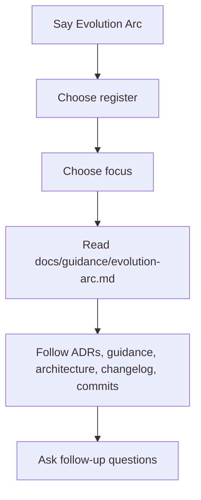

# Evolution Arc

Use this path when you want to understand how the workspace became what it is.

If you are using an AI-assisted editor, say `Evolution Arc` in chat. The agent will first ask which register you want to use:

- **Practitioner** for working detail and architectural trace
- **Orientation** for a step-by-step path through the same structure

Then it will ask which part of the arc you want to follow.

## What this path is for

`Evolution Arc` is a guided history path through the repo's reasoning trace.

It is for questions like:

- how did this workspace get here?
- why is the repo structured this way?
- which ADRs changed the architecture?
- what reflections changed the guidance?
- where do the major shifts show up in the changelog?

It is not the same as `onboard me`.

Use `onboard me` when you need setup, structure, or contribution guidance.

## How the path works

## Primary trace surfaces

The first implementation is repo-first.

Start with:

- [`docs/guidance/evolution-arc.md`](../guidance/evolution-arc.md) for the curated map
- [`AGENTS.md`](../../AGENTS.md) for canon and evolution discipline
- [`docs/architecture/workspace.md`](../architecture/workspace.md) for current structure
- [`docs/decisions/README.md`](../decisions/README.md) and the ADRs for structural rationale
- [`docs/guidance/`](../guidance/) for reflection and guardrails
- [`CHANGELOG.md`](../../CHANGELOG.md) for release-level chronology

Commits are supporting chronology.

PR descriptions and discussions are important, but they are a later expansion surface rather than the first contract of this path.

## Manual path

If you are not using an AI-assisted editor:

1. Read [`docs/guidance/evolution-arc.md`](../guidance/evolution-arc.md).
2. Read [`docs/decisions/README.md`](../decisions/README.md) and ADR `0002`.
3. Read the reflection docs in [`docs/guidance/`](../guidance/).
4. Use [`CHANGELOG.md`](../../CHANGELOG.md) to follow release-level shifts.
5. Drop to commits only when you need finer chronology.

## Boundaries

- This path is for history and rationale, not setup.
- It should stay grounded in inspectable repo sources.
- It should not overpromise access to PR or discussion trace before that surface is deliberately expanded.

<!--
Copyright © 2026 Mikey Sebastian Drozd.
Licensed under CC BY 4.0. Repository code and tooling: MIT.
-->
